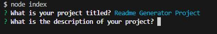
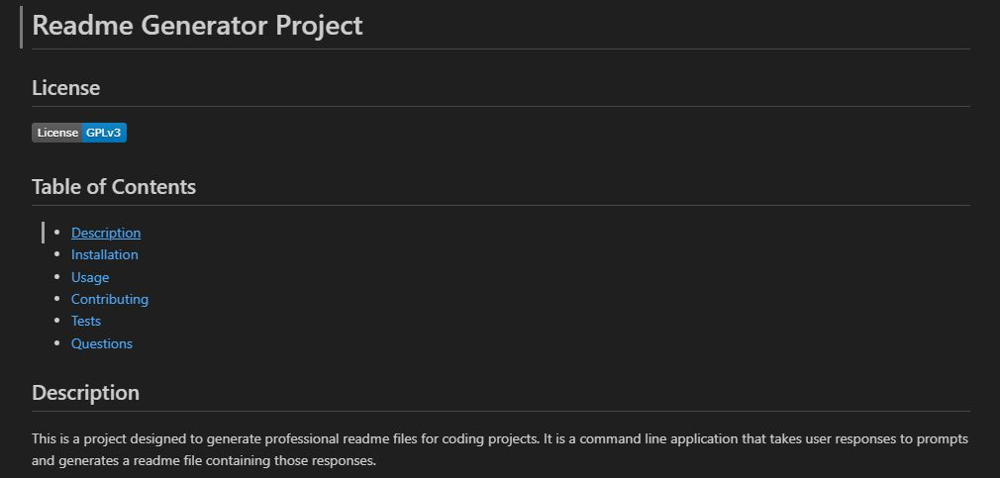

# My Readme Generator Project

## Description
The point of this project was to create an efficient means of generating organized and professional readme files for coding projects.  The result is a command-line application that prompts the user with questions, take their inputted answers about their projects, and generates a professional readme organized into multiple sections and containing a table of contents for easier navigation. 

## Installation
This is a node project, so installation of this project will require  the user to have the latest version of nodejs downloaded.  To install this project, one must first clone this repo to their local device.  Then, navigate to the repository in their local integrated development environment and install the necessary packages using the "npm install" command in the terminal.  Having done this, the user can run the program from the command line with the command "node index".  The series of prompts used to generate the readme file should then begin automatically.

## Usage
Upon running the application, this is a screenshot of what the prompts will look like.  This screenshot is after the first  prompt has already been filled but before the second prompt has:

Following the completion of all of the prompts, a readme file will be generated in the "output" folder that will look like this (varying depending on user responses):

The following is a link to a walkthrough video that demonstrates all of the functionality of the program:
[Readme Generator Walkthrough Video](https://drive.google.com/file/d/1N0OTUK0_sng83SKRTTgX4Dl_CVm2ezTg/view)

## Contributing
N/A

## Tests
N/A

## Credits

https://stackoverflow.com/questions/54321161/how-to-write-a-file-to-specific-directory-in-nodejs

https://gist.github.com/lukas-h/2a5d00690736b4c3a7ba